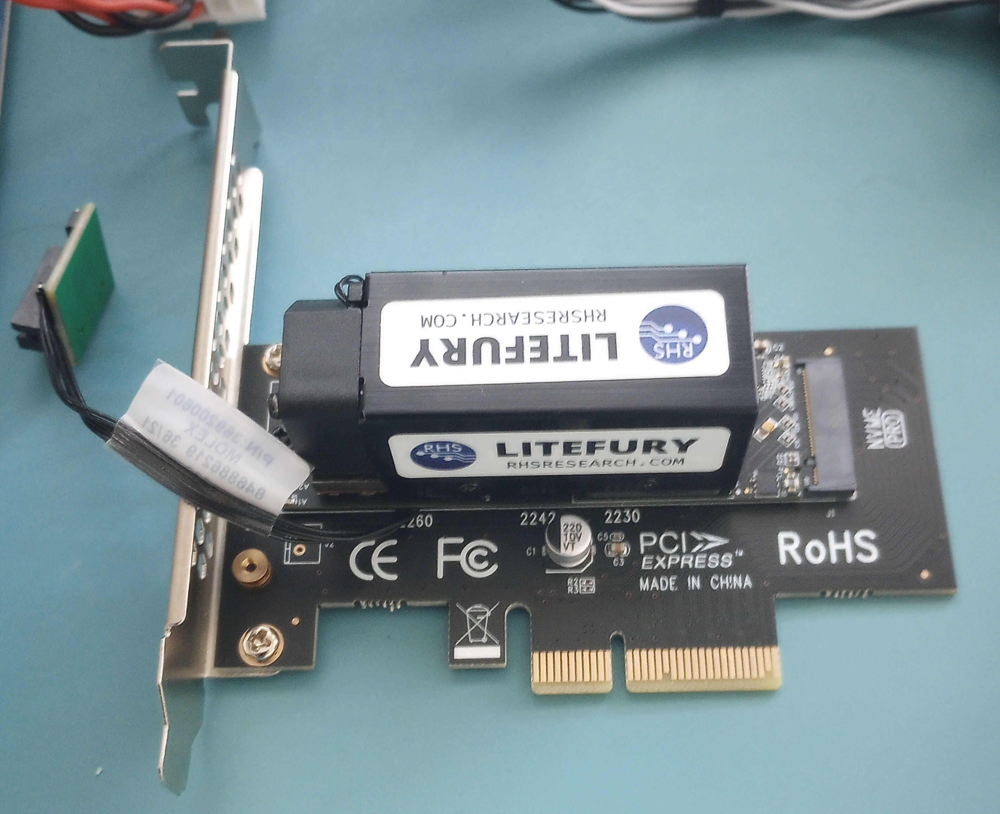
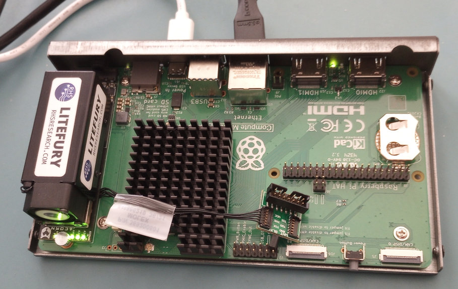

# litefury_pcie
A little project to provide the fpga design for the RHS Research LiteFury M.2 PCIe board.

## Submodules
This project references an external iir_filter repo so a submodule has been added. After you clone this repo you must run:
```
git submodule init
git submodule update
```

## Results
The PCIe lanes are wired in a non-standard way on this board. TCL reset_property and set_property commands were added to compile.tcl to handle this.  The resulting design enumerates as a Gen 2 x4 PCIe device when installed in a PC.

## Files
- litefury - a minimal pcie design that enumerates
- clock_reset_test - a tiny design that verifies the pcie reference clock and reset

## Compilation
    cd litefury/implement
    vivado -mode batch -source setup.tcl
    vivado -mode batch -source compile.tcl
    vivado -mode batch -source spi_program.tcl

# Test
I installed the LiteFury onto a very inexpensive four lane PCIe to M.2 adapter to facilitate removal and replacement. The board functions correctly that way.


I also tried a one lane PCIe on the Raspberry Pi Compute Module 5 IO Board. This works well and is something like a low-cost ZynqMP.


The Xilinx PCIe core provies two address regions. The 64KB region is for DMA access. The 1MB region allows random access to the whole address space.
```
$ lspci -v -s 01:01:00
0001:01:00.0 RAM memory: Xilinx Corporation Device 7021
	Subsystem: Xilinx Corporation Device 0007
	Flags: bus master, fast devsel, latency 0, IRQ 39
	Memory at 1b80100000 (32-bit, non-prefetchable) [size=64K]
	Memory at 1b80000000 (32-bit, non-prefetchable) [size=1M]
	Capabilities: <access denied>
	Kernel driver in use: xdma
	Kernel modules: xdma
```

